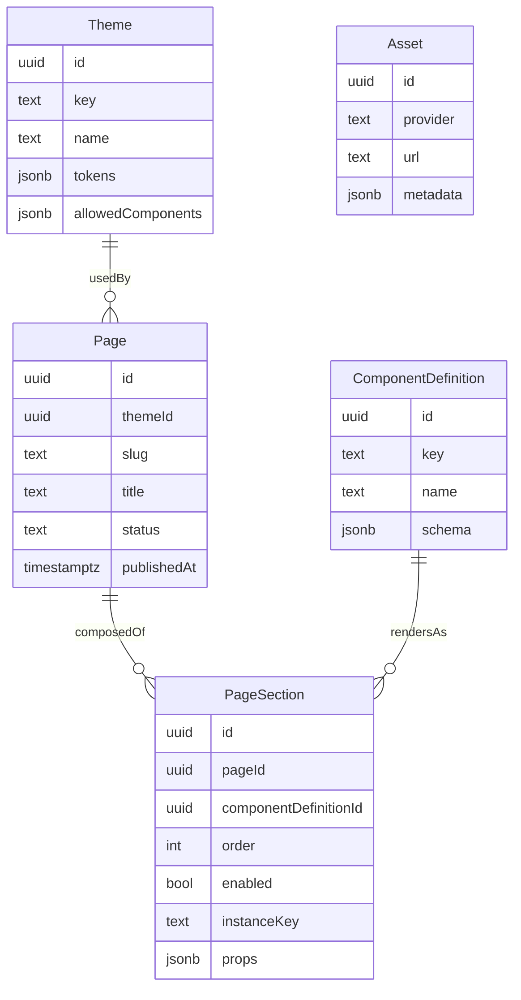

# Next.js App Router + Prisma CMS/Page Builder (Minimal MVP)

## Goal
Build a schema-driven, DB-backed page builder where developers ship React section components + schemas and admins compose pages (add/reorder/configure/enable) without storing raw HTML. Keep it monolithic and fast to ship, but with foundations that won’t force a rewrite.

## Core design choices (MVP)
- **Hybrid storage**:
  - **Relational** for page structure (pages + section rows + ordering)
  - **JSONB** for flexible values (theme tokens, section props, component schemas)
- **No giant page JSON blob**: store each section as a row in `page_sections`.
- **Components live in code** (registry). DB stores a FK to a component definition + per-instance props.
- **Server-side validation is mandatory** (AJV). Client-side validation is optional.
- **Draft → publish**: admins edit drafts; public site renders published pages only (recommended).

## Minimal database architecture
### 1) `themes`
- **Relational**: `id`, `key`, `name`
- **JSONB**: `tokens` (design tokens)
- **Required** (you have 2+ themes): `allowed_components` JSONB string array (simple theme allowlist).

### 2) `component_definitions`
- **Relational**: `id`, `key`, `name`
- **JSONB**: `schema` (JSON Schema 2020-12 for admin form generation + validation)

### 3) `pages`
- **Relational**: `id`, `theme_id`, `slug`, `title`, `status(draft|published)`, `published_at`

### 4) `page_sections`
- **Relational**: `id`, `page_id`, `component_definition_id`, `"order"`, `enabled`, `instance_key`
- **JSONB**: `props` (validated against the component schema)

### 5) `assets` (optional)
Keep `assets` in MVP to support images/files referenced by section props.

## ER relationships (MVP)
- `Theme 1—N Page`
- `Page 1—N PageSection`
- `ComponentDefinition 1—N PageSection` via FK (`page_sections.component_definition_id`)

## ER diagram (MVP)


## PostgreSQL DDL (MVP)
This is the minimal SQL to support the architecture (UUID PKs, JSONB, and the key indexes).

```sql
-- Theme
create table themes (
  id uuid primary key default gen_random_uuid(),
  key text not null unique,
  name text not null,
  tokens jsonb not null default '{}'::jsonb,
  -- Required allowlist per theme: ["hero","faq","pricing"]
  allowed_components jsonb not null default '[]'::jsonb,
  created_at timestamptz not null default now(),
  updated_at timestamptz not null default now()
);

-- ComponentDefinition
create table component_definitions (
  id uuid primary key default gen_random_uuid(),
  key text not null unique,
  name text not null,
  schema jsonb not null,
  created_at timestamptz not null default now(),
  updated_at timestamptz not null default now()
);

-- Page
create table pages (
  id uuid primary key default gen_random_uuid(),
  theme_id uuid not null references themes(id),
  slug text not null,
  title text not null,
  status text not null default 'draft' check (status in ('draft','published')),
  published_at timestamptz null,
  created_at timestamptz not null default now(),
  updated_at timestamptz not null default now(),
  constraint pages_slug_unique unique (slug)
);

create index pages_theme_id_idx on pages(theme_id);

-- PageSection
create table page_sections (
  id uuid primary key default gen_random_uuid(),
  page_id uuid not null references pages(id) on delete cascade,
  component_definition_id uuid not null references component_definitions(id),
  "order" int not null,
  enabled boolean not null default true,
  instance_key text not null,
  props jsonb not null default '{}'::jsonb,
  created_at timestamptz not null default now(),
  updated_at timestamptz not null default now(),
  constraint page_sections_instance_unique unique (page_id, instance_key)
);

create index page_sections_page_order_idx on page_sections(page_id, "order");
create index page_sections_component_definition_id_idx on page_sections(component_definition_id);

-- Optional: Asset (only if you need uploads/assets)
create table assets (
  id uuid primary key default gen_random_uuid(),
  provider text not null default 'external',
  url text not null,
  metadata jsonb null,
  created_at timestamptz not null default now()
);

create index assets_url_idx on assets(url);
```

Operational notes:
- `gen_random_uuid()` typically requires enabling `pgcrypto`. If you don’t want extensions, generate UUIDs in the app layer (Prisma can do this) and remove the defaults.
- In production, keep `updated_at` current via Prisma `@updatedAt` (recommended) or a DB trigger.
- Multi-site can be added later by introducing a `sites` table and changing `pages.slug` uniqueness to `(site_id, slug)`.

## Page composition model
- A page is the ordered list of `page_sections` rows.
- Reorder = update `"order"` values (batch endpoint).
- Enable/disable = toggle `enabled`.
- Configure = update `props` JSONB (validated).

## Component schema + validation model
- Store JSON Schema in `component_definitions.schema`.
- Validation on write:
  - On section create/update, validate `page_sections.props` using AJV against the component’s schema.
  - Optionally apply defaults during validation (AJV `useDefaults`).
- Theme allowlist enforcement:
  - When adding/updating a section on a page, ensure the page’s theme allows the component (component key must be present in `themes.allowed_components`).

## Rendering architecture (Next.js App Router)
- Public route: `app/(site)/.../page.tsx` (server component).
- Server loads:
  - published page by slug (and optionally site)
  - theme tokens
  - ordered sections + component keys
- Renderer:
  - `DynamicRenderer` iterates enabled sections
  - resolves React component via `ComponentRegistry[themeKey][componentKey]`
  - renders `<Component {...props} />`
- Unknown component: render a safe `UnknownSection`.

Caching note (MVP):
- Keep this route **dynamic** so DB edits reflect quickly after publish.
- Later, add tag-based revalidation (e.g. revalidate by `pageId`) when you want caching.

## Admin panel architecture
- Routes:
  - `app/admin/pages/page.tsx` (list)
  - `app/admin/pages/[pageId]/page.tsx` (builder)
- Schema-driven forms:
  - fetch schema for the chosen component definition
  - generate fields dynamically (simple mapper or `@rjsf/core`)
  - save props via API; backend validates with AJV

## Admin auth (required for production-worthiness)
Keep this minimal: one auth system, one set of guards, no microservices.

- **Protect all `/admin/*` routes**:
  - Require login to access admin pages.
- **Protect all admin API routes** (`/api/pages/*`, `/api/sections/*`, `/api/components/*`, `/api/themes/*`):
  - Reject unauthenticated requests
  - Optionally enforce a simple role model (e.g. `admin`, `editor`)

Implementation options (pick one, keep it simple):
- NextAuth/Auth.js (credentials or OAuth)
- Clerk (hosted)
- Custom email+password (only if you must; more work)

## API structure (Next.js Route Handlers)
- Public:
  - `GET /api/pages/resolve?slug=...` (single-site MVP)
- Admin:
  - `GET /api/themes`
  - `GET /api/components`
  - `GET /api/components/:key/schema`
  - `POST /api/pages`
  - `PATCH /api/pages/:pageId`
  - `POST /api/pages/:pageId/sections`
  - `PATCH /api/sections/:sectionId` (props/enabled/order)
  - `POST /api/pages/:pageId/sections/reorder`
  - `POST /api/pages/:pageId/publish`

Notes:
- Public endpoint should only return `status='published'` pages.
- Admin endpoints can operate on drafts and published pages (your choice); simplest is “edit draft then publish”.

## What is overkill (excluded completely in MVP)
- `theme_components` join table + per-theme constraints (replace with JSON array allowlist or skip)
- Component/theme versioning
- Nested sections / slots / trees
- Reusable section templates
- Page revisions/history
- Client-side AJV parity (optional later)
- Multi-tenant `sites` model (omit if single site)

## Future extensibility (add later without rewrites)
- Add `theme_components` join table when allowlists need constraints/auditing.
- Add `version` columns when schemas start evolving.
- Add reusable sections (`section_templates`) when duplication becomes painful.
- Add nesting by adding `parent_section_id` + `slot` to `page_sections` (or a dedicated node table).
- Add revisions via `page_revisions` snapshots.

## Tradeoffs (explicit)
- JSONB props are flexible but not ideal for analytics queries; add derived columns later if needed.
- Schema-driven admin reduces custom UI work but requires schema discipline.
