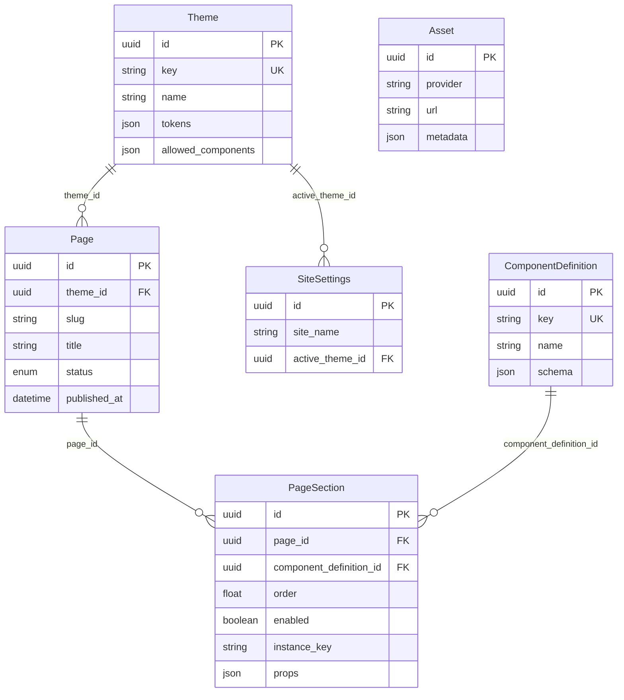

# Admin Panel (CMS / page builder MVP)

A **Next.js** app that stores pages as ordered **sections** in PostgreSQL, validates props against **JSON Schema**, and renders the public site by resolving each section to a React component. **Themes** (`modern`, `minimal`, `bold`) supply design tokens; **component definitions** live in code and sync into the database.

---

## Entity-relationship diagram

Tables match [`prisma/schema.prisma`](prisma/schema.prisma). Relationships:



**Notes:**

- **`Page`**: Unique `(theme_id, slug)` — each theme has its own URL tree.
- **`PageSection`**: Deleting a page **cascades** to sections. **`instance_key`** is unique per page (stable identity for edits).
- **`Asset`**: Standalone table (no FK from pages in this schema).
- **`SiteSettings`**: Holds **`active_theme_id`** — the public site only resolves **`published`** pages for that theme.

---

## Project structure

High-level layout (not every file):

```text
admin-panel/
├── app/
│   ├── (site)/[[...slug]]/     # Public marketing pages from DB + DynamicRenderer
│   ├── admin/                   # Admin UI (protected by middleware)
│   │   ├── login/
│   │   └── pages/
│   ├── api/                     # REST for pages, sections, themes, health
│   ├── preview/home/            # Internal preview helper
│   └── layout.tsx
├── components/
│   ├── admin/                   # PageBuilder, SchemaForm, theme switcher, etc.
│   ├── sections/
│   │   └── marketing.tsx        # Shared section implementations (Hero, FAQ, …)
│   └── themes/
│       ├── _definitions/        # JSON Schema + metadata → synced to DB
│       ├── modern/              # Optional theme-specific variants (e.g. Hero)
│       ├── minimal/
│       └── bold/
├── lib/
│   ├── admin/                   # Server actions, guards, reorder, active theme
│   ├── auth/                    # requireAdmin for API routes
│   ├── components/sync.ts       # Upserts component_definitions from code
│   ├── db.ts                    # Prisma client
│   ├── registry/index.ts        # componentKey → React component + allowlist
│   ├── renderer/
│   │   └── DynamicRenderer.tsx  # Maps sections to components
│   ├── theme/ThemeProvider.tsx  # CSS variables from theme tokens
│   └── validation/validateProps.ts
├── prisma/
│   ├── schema.prisma
│   ├── migrations/
│   └── seed.ts
├── scripts/sync-components.ts   # CLI to sync definitions (also runs via seed)
└── middleware.ts               # Protects /admin/* (NextAuth JWT)
```

---

## Admin UI flow

1. **Auth** — Visiting `/admin` or `/admin/pages` triggers **`middleware`**: unauthenticated users redirect to **`/admin/login`**. Credentials are checked against **`ADMIN_EMAIL`** / **`ADMIN_PASSWORD`** (NextAuth JWT).

2. **Dashboard** — **`/admin`** links into the page builder area.

3. **Pages index** — **`/admin/pages`** lists **pages for the active theme only**. Users can **switch the active theme** (updates `site_settings.active_theme_id`; guards ensure no invalid sections block the switch).

4. **Create page** — **`NewPageForm`** calls the **`createPage`** server action → new row in **`pages`** scoped to **`themeId`** of the active theme.

5. **Edit page** — **`/admin/pages/[pageId]`** loads **`PageBuilder`**: lists sections, **add/remove/reorder** sections, edit **props** via **`SchemaForm`** (driven by **`component_definitions.schema`**). Saving calls server actions / APIs that validate with **AJV** and enforce **component allowlists** per theme.

6. **Publish** — Publish/unpublish updates **`pages.status`** (and **`published_at`**). Only **`published`** pages are rendered on the public catch-all route.

7. **Public site** — **`app/(site)/[[...slug]]/page.tsx`** loads **`site_settings`**, finds a **published** page matching the slug and **active theme**, then **`DynamicRenderer`** maps each section’s **`component_definitions.key`** to a React component.

---

## Core logic

| Concern | What happens |
|--------|----------------|
| **Component catalog** | Definitions (`key`, `name`, JSON Schema) live under **`components/themes/_definitions/`**. **`syncComponentDefinitions`** (seed / script) **upserts** rows in **`component_definitions`**. The **code** remains the source of truth for schema shape. |
| **Registry & rendering** | **`lib/registry/index.ts`** maps each **`component_definitions.key`** (e.g. `hero`, `faq`) to a shared implementation in **`components/sections/marketing.tsx`**. **`DynamicRenderer`** calls **`resolveComponent(themeKey, componentKey)`** and spreads stored **`props`** into the component. Optional per-theme overrides exist via **`themeOverrides`**. |
| **Theme tokens** | **`themes.tokens`** (JSON) is passed through **`ThemeProvider`** as CSS variables for typography, spacing, and section UI presets (`sectionUi`). |
| **Allowlist** | **`getAllowedComponents(themeKey)`** returns which section types a theme may use (aligned with the in-code registry). **Publish** and **theme switch** paths run **guards** so pages cannot reference disallowed or invalid sections. |
| **Validation** | **`validateProps`** uses **AJV** + each definition’s **`schema`** so API routes and server actions reject invalid JSON payloads before they hit the DB. |
| **Ordering** | Sections use a **`order`** float; reorder logic computes new positions (see **`lib/admin/reorder.ts`**) so inserts between sections stay stable. |

---

## Setup

**Prerequisites:** Node.js 18+, **PostgreSQL**, and `npm` (or `pnpm`/`yarn`).

1. **Clone and install**

   ```bash
   git clone <repository-url>
   cd admin-panel
   npm install
   ```

2. **Environment**

   Copy **`.env.example`** to **`.env`** and set:

   - **`DATABASE_URL`** — PostgreSQL connection string (same database for app + migrations).
   - **`DIRECT_URL`** — Often the same as `DATABASE_URL`; required in schema for migrations (e.g. non-pooled URL if you use a pooler).
   - **`NEXTAUTH_URL`** — Base URL of the app (e.g. `http://localhost:3000`).
   - **`NEXTAUTH_SECRET`** — Long random string for JWT signing.
   - **`ADMIN_EMAIL`** / **`ADMIN_PASSWORD`** — Single admin login for credentials provider.

3. **Database**

   ```bash
   npx prisma migrate dev
   ```

   (Or **`npx prisma migrate deploy`** in CI/production.)

4. **Generate client & seed**

   ```bash
   npx prisma generate
   npm run db:seed
   ```

   Seed creates themes, syncs **component_definitions**, **site settings**, and demo pages.

5. **Optional: sync definitions only**

   ```bash
   npm run sync:components
   ```

6. **Run**

   ```bash
   npm run dev
   ```

   Open **`http://localhost:3000`** for the public site (uses the **active** theme from seed, typically **modern**). Admin: **`http://localhost:3000/admin/login`**.

7. **Production build**

   ```bash
   npm run build
   npm start
   ```

---

For schema or migration history, see **`prisma/migrations/`**.
